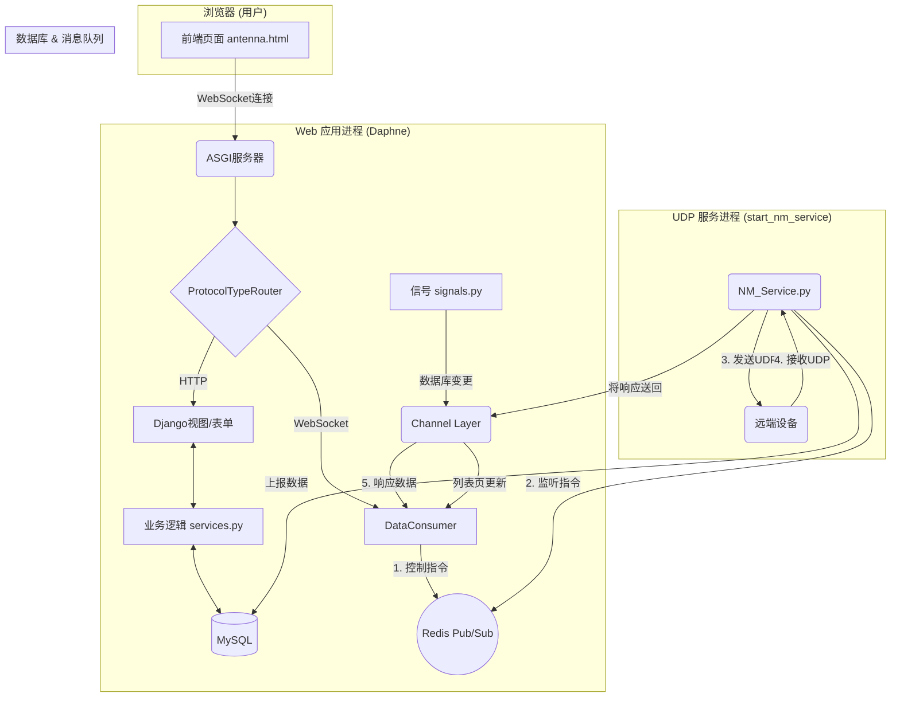

# 船舶端站管理系统 (MBP) - 技术文档


## 1. 项目概述

船舶端站管理系统 (MBP) 是一个基于 Django 框架开发的 Web 应用，旨在提供对船舶、船载端站及地面基站基础信息的集中管理（CRUD）功能。

本项目最大的技术特点是其**双重实时交互能力**：

1. **后端驱动的实时更新**：集成了 **Django Channels**，实现了基于 WebSocket 的实时数据更新机制。当后台数据库发生任何（增、删、改）变化时，前端所有打开的列表页面都会收到通知并自动刷新。
2. **前端驱动的实时控制**：新建的“端站数据与控制”页面允许管理员主动与远端设备进行实时交互。通过一个**解耦的、独立运行的UDP服务**和 **Redis 消息队列**，实现了从网页发送控制指令、接收设备响应并实时展现在前端的完整闭环。

本文档旨在为后续的开发及维护人员提供清晰、准确的技术指引。


## 2. 技术栈

- **后端框架**: Django
- **异步与WebSocket**: Django Channels
- **消息队列/信道层**: Redis
- **数据库**: MySQL
- **前端**: Bootstrap 5, JavaScript (ES6)
- **ASGI 服务器**: Daphne
- **运行环境**: Python


## 3. 架构设计

MBP系统采用了一种现代的、解耦的Web应用架构，由三个核心部分组成：**Web应用进程**、**UDP服务进程**以及作为它们通信桥梁的**Redis服务**。



- **Web应用进程 (Daphne)**: 负责处理用户的HTTP请求（页面访问、表单提交）和WebSocket长连接。`DataConsumer` 是WebSocket的核心，它处理所有实时消息的收发。
- **UDP服务进程 (`NM_Service.py`)**: 作为一个独立的后台服务运行，通过`manage.py start_nm_service`启动。它有两个主要职责：
  1. 持续监听UDP端口，接收端站设备的主动上报数据，并写入数据库。
  2. 监听Redis的`udp-command`频道，接收来自Web应用的控制指令，将其通过UDP发送给设备，并负责将设备的响应转发回Web应用。
- **进程间通信 (IPC)**:
  - **控制指令 (Web -> UDP)**: `DataConsumer` 使用标准的 `redis-py` 客户端，通过 `PUBLISH` 命令将指令发送到`udp-command`频道。这是一种发布/订阅模式，实现了两个进程的完全解耦。
  - **指令响应 (UDP -> Web)**: `NM_Service` 在收到设备响应后，使用 Django Channels 提供的 `get_channel_layer()`，通过 `group_send` 将响应发送到由`DataConsumer`为该次请求动态创建的唯一组（Group）中。这确保了响应能被精确地路由回发起请求的用户。


## 4. 核心组件详解

### 4.1. 数据库模型 (`models.py`)

系统数据库包含四个核心模型，详细字段请参考源文件 `terminal_management/models.py`。

- `ShipInfo`: 存储船舶基础信息。
- `TerminalInfo`: 存储端站设备信息，并与`ShipInfo`建立外键关联。
- `BaseStationInfo`: 存储地面基站信息。
- `TerminalReport`: **核心数据表**。用于存储所有端站上报的状态信息，数据量可能很大。为此，该模型特别设计了**复合唯一约束** (`type`, `sn`, `report_date`, `report_time`) 和**联合索引** (`sn`, `report_date`) 以优化查询性能。


### 4.2. 后端业务 (`consumers.py`)

`DataConsumer` 是处理所有实时通信的后端核心。

- **异步任务处理**: 为了防止任何耗时操作（如数据库查询、等待UDP响应）阻塞WebSocket的主通信循环，所有请求都被 `asyncio.create_task` 包装成后台任务执行。这确保了即使在高延迟下，服务器也能同时响应多个客户端的多个请求。
- **请求-响应匹配**:
  1. 当处理 `control_command` 时，`consumer` 会生成一个唯一的 `request_id`。
  2. 同时创建一个 `asyncio.Future` 对象，并将其与 `request_id` 关联，存入 `self.pending_replies` 字典中。
  3. `consumer` 随后 `await` 这个 `future` 对象，进入等待状态。
  4. 当 `NM_Service` 将响应发回，并由 `udp_reply` 方法接收到时，该方法会根据响应中的 `request_id` 找到对应的 `future`，并调用 `future.set_result()`。
  5. 这个调用会立即唤醒正在等待的 `handle_control_command` 任务，并将响应数据作为结果返回，从而完成一次精确的异步请求-响应匹配。


### 4.3. UDP服务 (`NM_Service.py`)

该服务经过了重构，不再使用 `EventManager`，而是采用更直接、健壮的多线程和线程锁模型。

- **多线程模型**:
  - `__udp_loop_thread`: 专门负责非阻塞地接收所有UDP数据。
  - `__redis_loop_thread`: 专门负责监听和处理来自Web应用的控制指令。
- **死锁安全**: 通过精细化管理 `threading.Lock`，确保了对共享资源 `__pending_requests` 的访问是线程安全的，同时避免了嵌套锁导致的死锁问题。
- **消息路由 (`route_message`)**: 所有UDP消息都会经过此方法。它通过检查消息体中是否存在 `request_id` 并且该ID是否存在于 `__pending_requests` 字典中，来智能地区分“设备响应”和“设备主动上报”。


### 4.4. 前端逻辑

- **`base.html`**: 提供了项目所有页面的基础模板。它包含了全局的WebSocket初始化逻辑。
  - **连接时机**: 通过 `window.dataSocket.onopen` 事件，提供了一个 `onSocketReady()` “钩子函数”。这确保了任何依赖WebSocket的页面逻辑，都只会在连接成功后才执行，完美解决了竞态条件问题。
  - **可扩展性**: 定义了一个全局数组 `window.webSocketOnMessageHandlers`。任何子页面都可以通过向此数组添加自己的消息处理函数，来实现特定的实时功能，而不会与全局逻辑（如列表页刷新）冲突。
- **`antenna.js`**: “端站数据与控制”页面的专属脚本。
  - **初始化**: 所有核心逻辑都被包裹在 `onSocketReady()` 函数中。
  - **消息处理**: 它定义了 `antennaPageMessageHandler` 函数，并将其注册到 `webSocketOnMessageHandlers` 数组中，专门负责处理 `latest_report_data` 和 `control_response` 类型的消息。


## 5. 通信协议简报

所有Web端与设备端的控制交互均遵循 `MBP通信协议.md` 中定义的JSON格式。

#### 查询工作模式 (示例)

- **Web端发送 (经`consumer`和`NM_Service`封装后)**:

  JSON

  ```
  {
      "sn": "SN000001",
      "op": "query",
      "op_sub": "work_pattern",
      "request_id": "a-uuid-string"
  }
  ```

- **端站应答**:

  JSON

  ```
  {
      "sn": "SN000001",
      "op": "query_ans",
      "op_sub": "work_pattern",
      "pattern": "0",
      "request_id": "a-uuid-string"
  }
  ```


## 6. 项目运行与部署

### 6.1. 环境依赖

- Python, Django, Channels, channels_redis, daphne
- MySQL 数据库
- Redis 服务器


### 6.2. 运行项目

本项目包含两个需要独立启动的服务进程。请**务必**打开两个终端窗口。

1. **终端 1: 启动UDP服务**

   Bash

   ```
   python manage.py start_nm_service
   ```

   该服务会持续在后台运行，处理所有UDP和Redis指令。

2. **终端 2: 启动Web服务器**

   由于项目使用了Channels，不能使用 runserver。必须使用ASGI服务器：

   Bash

   ```
   daphne -p 8000 mbp_project.asgi:application
   ```

   服务器将在 `8000` 端口上运行，处理所有HTTP和WebSocket请求。